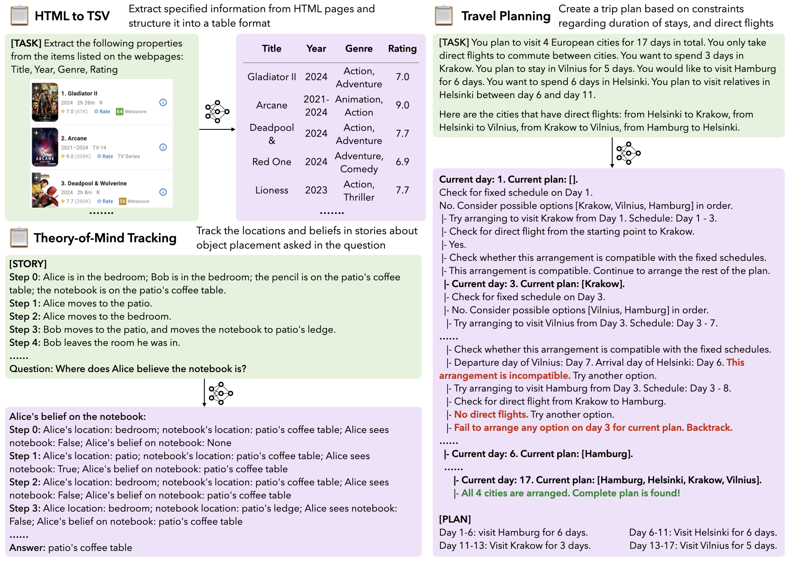
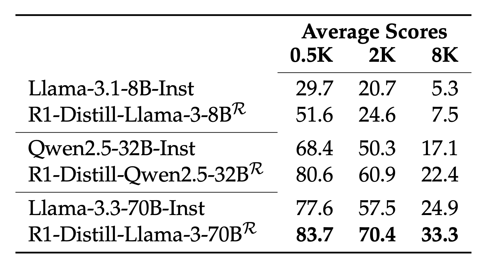
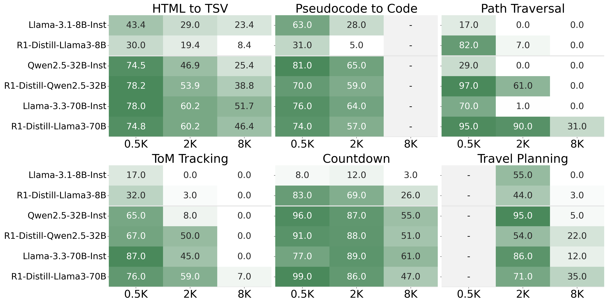
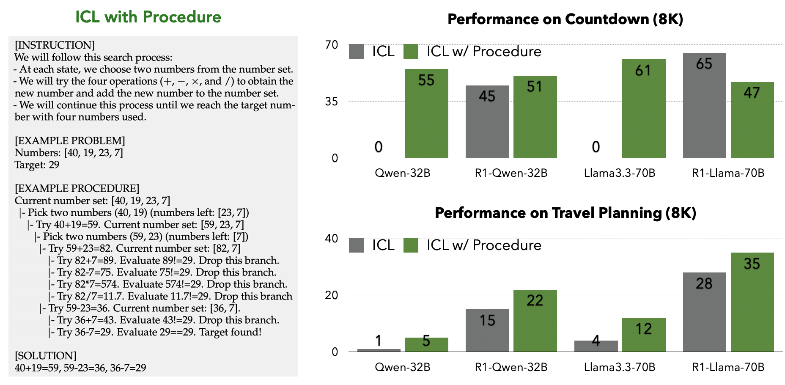

## How Training for Long Chain-of-Thought Improves General Long-Form Generation

**TLDR**:
> How does training LLMs with long chain-of-thought (CoT) (like distillation from DeepSeek-R1) impacts their general long-context capabilities? \
> To investigate this question, we evaluate a series of reasoning models on the [LongProc](https://princeton-pli.github.io/LongProc/) benchmark. Our results reveal some interesting findings:
> * Reasoning models outperform their instruction-tuned counterparts, suggesting benefits of long CoT training for long-form generation. However, there still remains substantial room for further improvements.
> * Instruction-tuned models, when prompted with detailed procedures showcasing branching and backtracking capabilities, can sometimes match the performance of reasoning models. Reasoning models also perform better when prompted with procedures.

### Evaluating Reasoning Models on LongProc

The recent emergence of large reasoning models has dramatically extended the length of CoT that LLMs can generate. Today's models like [OpenAI-o1/o](https://openai.com/o1/) and [DeepSeek-R1](https://github.com/deepseek-ai/DeepSeek-R1) can sustain thinking for up to 32K tokens when tackling complex reasoning problems. This capability closely aligns with the skills tested in our recent benchmark, [LongProc](https://princeton-pli.github.io/LongProc/).

<figure>
  
  <figcaption>Three (out of six) representative tasks in LongProc: HTML to TSV, Theory-of- Mind Tracking, Travel Planning. Tasks in LongProc require LLMs to follow a given procedure detailed by instructions and generate long-form outputs (up to 8K tokens) in a specified format.</figcaption>
</figure>

Here's a brief introduction to LongProc (Long Procedural Generation). LongProc is a benchmark specifically designed to test both the integration of highly dispersed information and long-form generation capabilities. It consists of six diverse procedural generation tasks, such as extracting structured information from HTML pages into TSV format and executing complex search procedures to create detailed travel plans.

In this blog post, we investigate the **connection between training on long CoT reasoning and LLMs’ broader long-context capabilities**. We evaluate three reasoning models distilled from DeepSeek-R1 (R1-Distill-Llama-8B, R1-Distill-Qwen-32B, R1-Distill-Llama-70B), and compare these reasoning-focused models against their instruction-tuned counterparts (Llama-3.1-8B, Qwen2.5-32B, Llama-3.3-70B). Each task in LongProc comes in three difficulty levels with maximum output requirements of 500, 2K, and 8K tokens. While LongProc primarily focuses on test long-form generation, some tasks such as HTML to TSV also exhibit long input text (over 32K tokens).

For instruction-tuned models, we set the maximum number of output tokens accordingly; for reasoning models, we allow generation of up to 16K tokens, accommodating the additional "thinking" tokens these models utilize during processing.

### Long CoT Training Improves General Long-Form Generation Capabilities

<figure>
  
  <figcaption>Comparison of overall performance between reasoning models and instruction-tuned models.</figcaption>
</figure>

The table above shows the average performance across tasks at different output lengths. The results suggest that long CoT training consistently improves long-form generation performance. For example, R1-Distill-Llama-3-70B improves upon Llama-3.3-70B-Instruct by an average of around 9.0 points at the 8K token level. However, there remains substantial room for improvement, as these models still struggle with the most demanding 8K-level tasks.

<figure>
  
  <figcaption>Comparison of overall performance between reasoning models and instruction-tuned models.</figcaption>
</figure>

**Which tasks benefit most from long CoT training?** When we examine performance across individual tasks, the most substantial improvements are observed in Path Traversal, with R1-Qwen-32B also showing gains in HTML to TSV compared to Qwen-32B-Inst. Interestingly, these tasks are generally considered less reasoning-intensive, with their difficulty mainly lying in identifying relevant information amid similar contexts.  For the three reasoning-focused tasks (bottom row), reasoning models substantially outperform their instruction-tuned counterparts in ToM Tracking and Travel Planning (8K). However, reasoning models show some performance degradation on Countdown (8K) and Travel Planning (2K). This occurs because they cannot generate final solutions within the 16K output token budget (see [Appendix A.2 of the paper](https://arxiv.org/pdf/2501.05414#page=19) for details).

### Both Instruct Models and Reasoning Models Benefit From Procedueral Generation

In LongProc, we prompt models with systematic solving procedures to elicit the branching and backtracking capabilities of instruct models (see the figure below for an example). Recent research also suggests reasoning models can acquire these capabilities through reinforcement learning or distillation. Below, we compare model performance on two tasks requiring systematic search procedures when prompted using two methods: 1) ICL (in-context learning) that provides input and output pairs (where output examples also help specify the formats) 2) ICL with Procedure that provides systematic solving procedure.

<figure>
  
  <figcaption>Performance comparison between standard ICL (input-output pairs) and ICL with procedure. Using procedure in prompts can enhance performance of both instruct and reasoning models.</figcaption>
</figure>

Interestingly, instruction-tuned models prompted with procedure sometimes match the performance of reasoning models (when those reasoning models are not provided with the same procedural prompting). This suggests that instruction-tuned models already possess many of the branching and backtracking capabilities we associate with specialized reasoning models: they simply need the right prompting to activate these abilities.

Furthermore, reasoning models also benefit significantly from procedural CoT prompting, which pushes their performance even higher on the challenging 8K token tasks. This indicates that explicit procedural guidance complements the implicit reasoning patterns these models have learned during training.

## Takeaways

In this blog post, we've examined how reasoning training enhances models' braoder long-context capabilities, particularly the long-form generation challenges in LongProc. Additionally, we've demonstrated that prompting with procedures is effective not just for instruction-tuned models but also for specialized reasoning models. Our findings point to new exciting research opportunities. Future research could explore how to better leverage this synergy: perhaps by creating synthetic tasks like LongProc to further tune reasoning models, or training reasoning models to discover systematic solving procedures autonomously.
